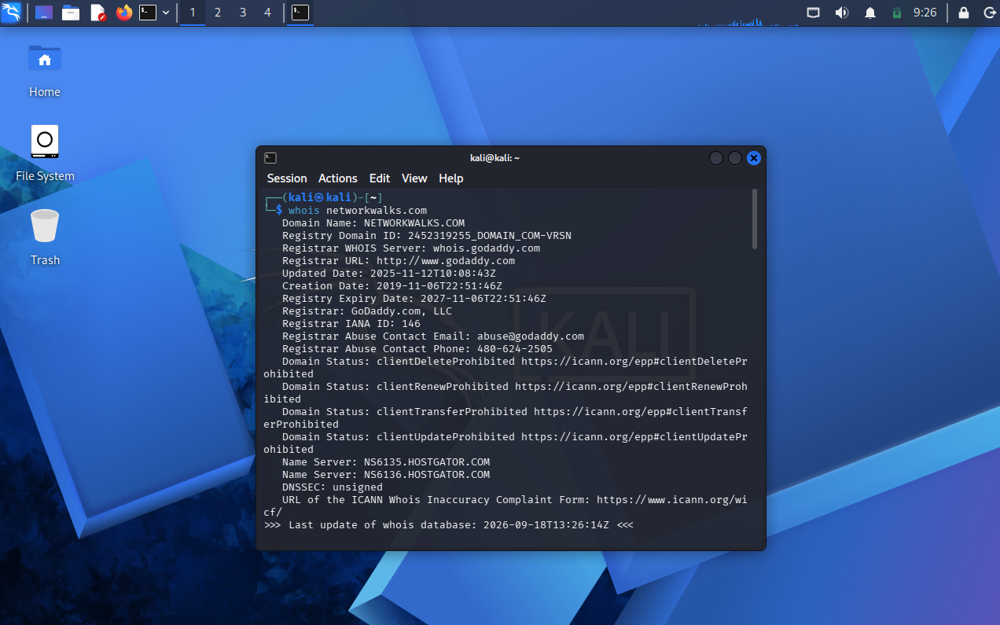
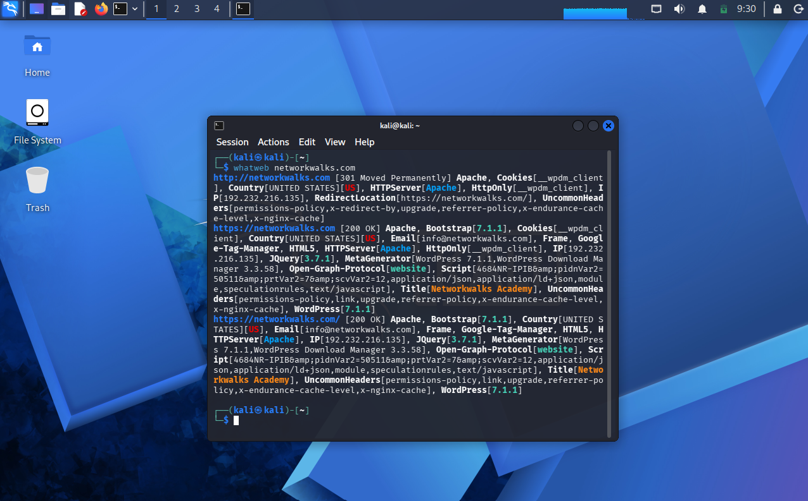
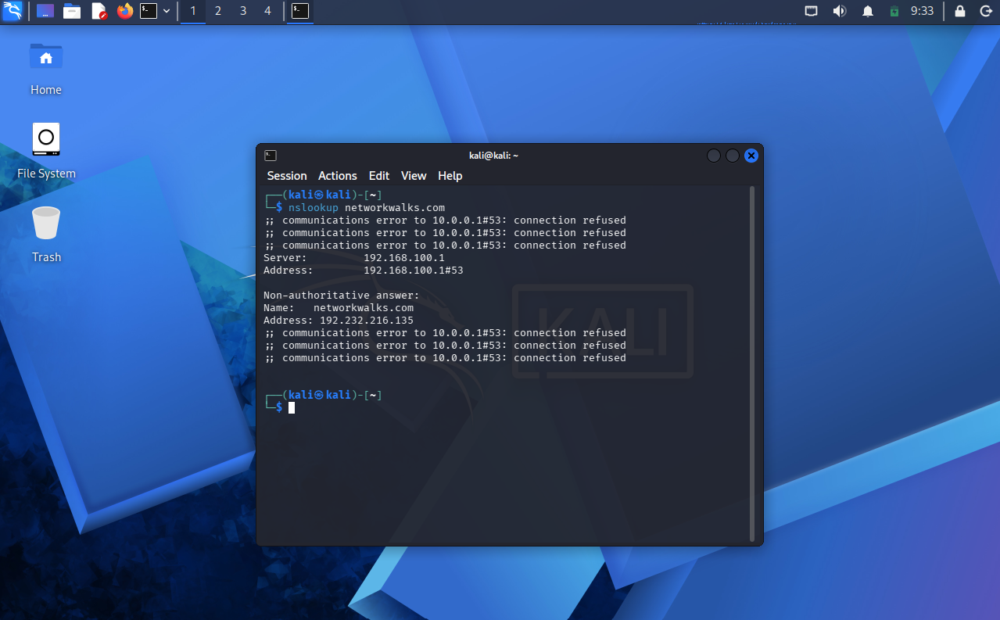
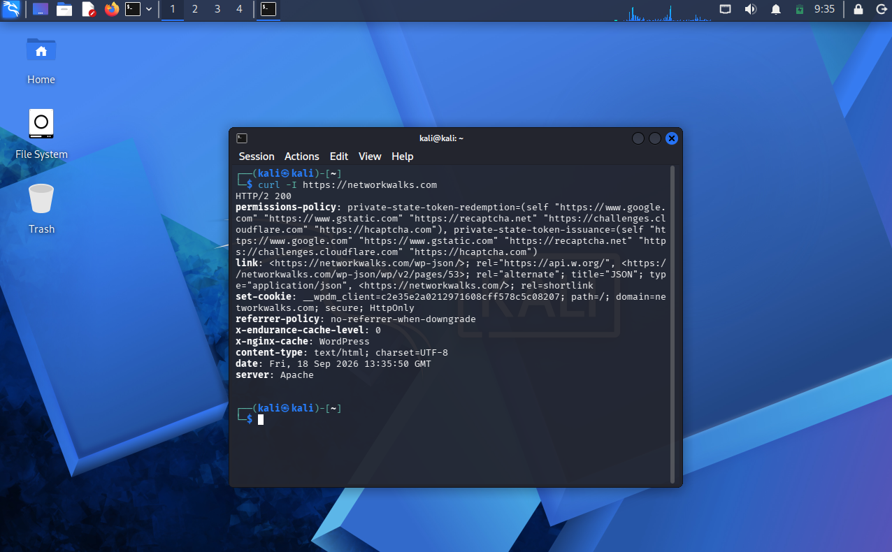
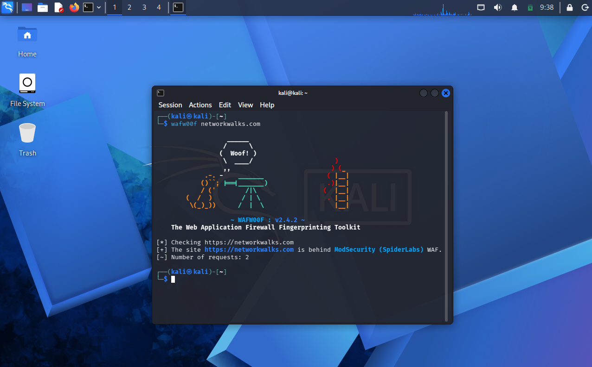
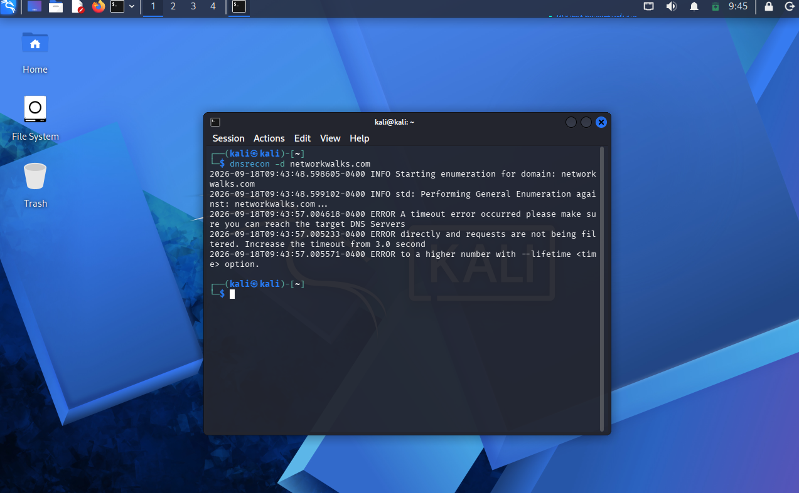
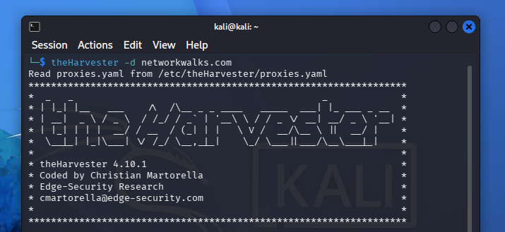

# 🔐 NETWORKWALKS-B083-WEEK2-PM1-CYBERSECURITY-RECON-LAB

# 🌐 Web Reconnaissance & Information Gathering Lab

**Track:** Cybersecurity Fundamentals  
**Environment:** Kali Linux 🐉  
**Target:** `networkwalks.com`  
**Exercise:** Authorized Reconnaissance ✅

## 📌 Overview

This lab focuses on performing basic reconnaissance and information gathering against an authorized domain using Kali Linux tools. The goal is to understand how security professionals collect publicly available information before further security assessment.

## 🛡️ Authorization & Responsible Testing

All reconnaissance activities in this lab were performed as part of an authorized cybersecurity exercise. The purpose was limited to information gathering and analysis without attempting to exploit or damage the target.

## 🎯 Purpose of the Exercise

The main objectives were to:

- 🔎 Gather domain and registration information
- 🌐 Identify DNS and IP information
- 🧩 Detect technologies used by the website
- 🔒 Check for web application firewall protection
- 📡 Examine DNS records
- 🗂️ Collect publicly available information

## 🧰 Reconnaissance Approach

| Step | Tool | Purpose |
|------|------|---------|
| 1️⃣ | `whois` | Domain registration information |
| 2️⃣ | `whatweb` | Website technologies |
| 3️⃣ | `nslookup` | DNS and IP resolution |
| 4️⃣ | `curl -I` | HTTP response headers |
| 5️⃣ | `wafw00f` | WAF detection |
| 6️⃣ | `dnsrecon` | DNS reconnaissance |
| 7️⃣ | `theHarvester` | Public information gathering |

## 🔍 Step 1 — WHOIS

Used `whois` to collect publicly available domain registration and ownership-related information.

## 🧪 Step 2 — WhatWeb

Used `whatweb` to identify technologies and components detected on the target website.

## 🌐 Step 3 — NSLookup

Used `nslookup` to resolve the domain name and identify its associated IP address.

## 📩 Step 4 — HTTP Headers

Used `curl -I` to examine the HTTP response headers returned by the website.

## 🧱 Step 5 — WAF Detection

Used `wafw00f` to check whether a Web Application Firewall could be detected.

## 📡 Step 6 — DNSRecon

Used `dnsrecon` to gather additional DNS-related information about the domain.

⚠️ Note: The timeout was due to the target DNS servers not responding to the enumeration requests, not an error in my configuration.

## 🗃️ Step 7 — TheHarvester

Used `theHarvester` to collect publicly available information associated with the target domain.

## 📊 Findings Summary

The reconnaissance process demonstrated how different tools can provide different types of information about the same target. Combining the results gives a broader view of the domain's public-facing infrastructure.

## 💡 Security Perspective

Reconnaissance is an important early stage of cybersecurity assessment because publicly exposed information can help security teams understand what information is visible to outsiders and identify areas that may require better protection.

## 🚀 Key Takeaways

- 🧠 Learned the purpose of common reconnaissance tools
- 💻 Practiced information gathering in Kali Linux
- 🌐 Improved understanding of DNS and web technologies
- 🔎 Learned how different tools complement each other
- 🛡️ Understood the importance of responsible reconnaissance

## 🛠️ Tools & Skills

**Tools:** Kali Linux, WHOIS, WhatWeb, NSLookup, cURL, WAFW00F, DNSRecon, TheHarvester

**Skills:** Web Reconnaissance, DNS Enumeration, Information Gathering, OSINT, Cybersecurity Fundamentals

## 👤 Author

**Author:** [Malak Ashraf]

**Focus:** Cybersecurity & Information Security
